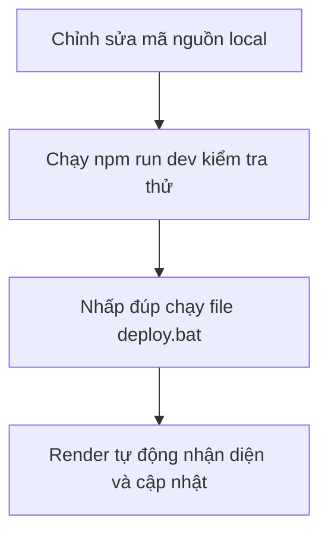

# HƯỚNG DẪN CHI TIẾT CẬP NHẬT & BẢO TRÌ HỆ THỐNG LỊCH CÔNG TÁC

Tài liệu này hướng dẫn bạn quy trình 4 bước đơn giản để chỉnh sửa, kiểm tra cục bộ và triển khai các thay đổi lên máy chủ Render hoạt động ổn định.

---

## QUY TRÌNH 4 BƯỚC CẬP NHẬT HỆ THỐNG



### Bước 1: Chỉnh sửa mã nguồn (Local Development)
Mở dự án tại thư mục `Lich 2.0` bằng phần mềm chỉnh sửa mã nguồn (ví dụ: VS Code) và tiến hành thay đổi giao diện, tính năng hoặc sửa lỗi theo nhu cầu.

### Bước 2: Kiểm tra cục bộ (Local Testing)
Trước khi đưa lên máy chủ chạy chính thức, hãy luôn kiểm tra xem mã nguồn có lỗi hay không:
1. Mở cửa sổ dòng lệnh (Terminal/Command Prompt) tại thư mục `Lich 2.0`.
2. Chạy lệnh:
   ```bash
   npm run dev
   ```
3. Mở trình duyệt truy cập vào địa chỉ: [http://localhost:3000](http://localhost:3000) để kiểm tra hoạt động. Nếu mọi thứ hoạt động trơn tru, bạn có thể chuyển sang bước tiếp theo.

### Bước 3: Đồng bộ lên GitHub (Push Code)
Tôi đã chuẩn bị sẵn tệp tự động hóa `deploy.bat` ở thư mục gốc của dự án. Bạn chỉ cần:
1. Nhấp đúp chuột vào tệp [deploy.bat](file:///f:/2- Hoan Thien Phan Men/Lich 2.0/deploy.bat).
2. Hệ thống sẽ tự động thực hiện:
   * Gom tất cả các tệp có thay đổi mới (`git add .`)
   * Tạo bản ghi nhận cập nhật phiên bản (`git commit`)
   * Đẩy mã nguồn lên kho lưu trữ GitHub riêng tư của bạn (`git push`)
3. Đợi cửa sổ cmd hoàn thành chạy và nhấn phím bất kỳ để đóng lại.

### Bước 4: Triển khai lên máy chủ Render (Deploy to Cloud)
Do máy chủ Render đã được kết nối trực tiếp với GitHub của bạn (ở nhánh `main`):
* **Tự động**: Ngay khi nhận được mã nguồn mới đẩy lên từ Bước 3, Render sẽ tự kích hoạt chế độ xây dựng hệ thống mới (build) và cập nhật ứng dụng chính thức tại trang web [https://lich-cong-tac.onrender.com](https://lich-cong-tac.onrender.com) trong khoảng 2 - 5 phút.
* **Thủ công**: Nếu vì lý do nào đó Render không tự build, bạn chỉ cần mở trang Web App của mình, kéo xuống **KHU VỰC 6 (Kiến trúc hệ thống)** -> Chọn tab **Cẩm nang Deploy** -> Nhấn nút **🚀 Kích hoạt Deploy ngay**. Nút này sẽ kích hoạt API Webhook của Render để buộc máy chủ cập nhật tức thì.

---

## MỘT SỐ LƯU Ý QUAN TRỌNG

> [!IMPORTANT]
> **Không chỉnh sửa trực tiếp trên máy chủ Render**: Mọi thay đổi phải xuất phát từ máy tính cục bộ của bạn (local), sau đó đẩy lên GitHub để Render tự động build lại. Render sử dụng bộ nhớ đĩa tạm thời (ephemeral disk), việc sửa trực tiếp trên máy chủ sẽ bị mất khi khởi động lại.

> [!WARNING]
> **Bảo mật file khóa (.env)**: Tệp cấu hình chứa các khoá bí mật API (như `GEMINI_API_KEY`) cần được thiết lập trên mục **Environment Variables** (Biến môi trường) của Render thay vì đẩy trực tiếp lên GitHub để tránh lộ thông tin bảo mật.
